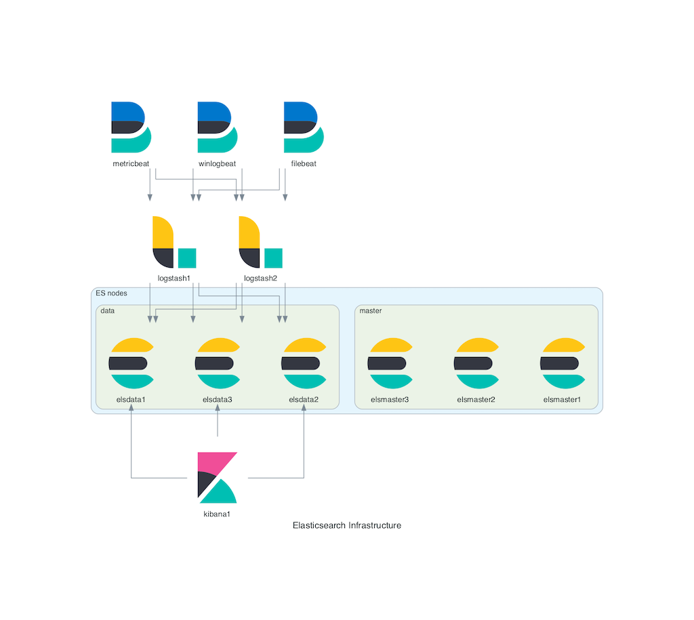

# ansible-diagrams

An example script showcasing the usage of [diagrams module](https://github.com/mingrammer/diagrams) and [Ansible API](https://docs.ansible.com/ansible/latest/dev_guide/developing_api.html) for creating architecture diagrams in Python 3 by fetching hosts from ansible inventory groups.

Assuming the following inventory in `/path/inventory`:
```
[els_master]
elsmaster1.example.com
elsmaster2.example.com
elsmaster3.example.com

[els_data]
elsdata1.example.com
elsdata2.example.com
elsdata3.example.com

[logstash]
logstash1.example.com
logstash2.example.com

[kibana]
kibana1.example.com
```
The script will produce the following diagram (the beat nodes have been hardcoded for demo purposes):


